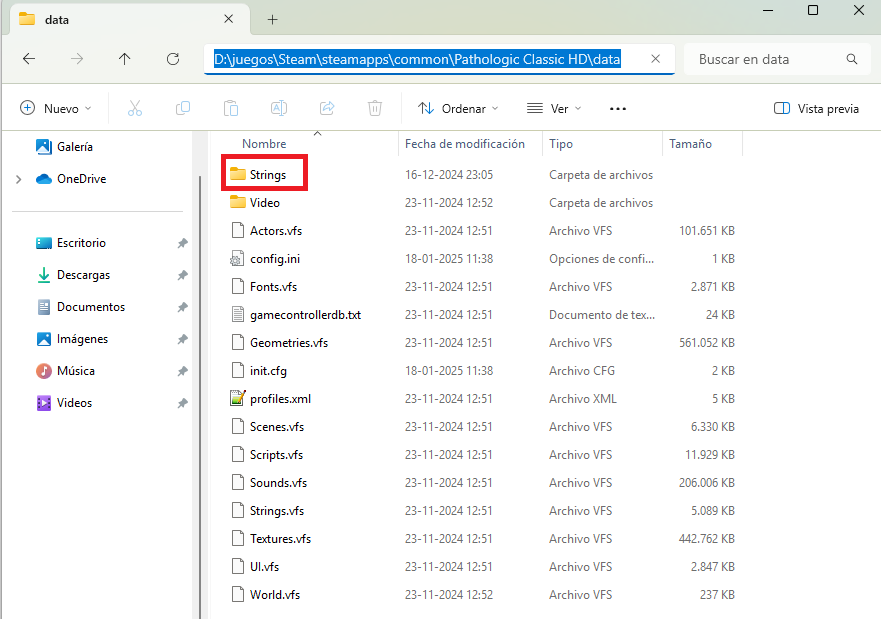

# Descripción
Traducción al español del juego Pathologic Classic HD

# Instrucciones
Descargar el repositorio como archivo ZIP ('Code' -> 'Download ZIP') y descomprimir.

Copiar el directorio 'Strings' dentro del directorio 'data' de la carpeta de instalación del juego (En Steam, boton derecho sobre el juego -> Propiedades -> Archivos Instalados -> Explorar).

El resultado final deberia verse como en la siguiente imagen:

 

Si lo anterior no funciona inmediatamente, verificar que el directorio 'Strings' este en la ubicación correcta.
Si no fuera el caso, dentro del archivo '_**GAME**_\data\config.ini', modificar la línea 

<pre>StringsType = VFS</pre>

por

<pre>StringsType = FS</pre>

# Enlaces y Agradecimientos
Gracias a [**somevideoguy**](https://github.com/somevideoguy/pathologic) por publicar los scripts en python que permitió esta traducción.

Esta traducción fue posible gracias a las herramientas de libre acceso:
- [Python 3.13.0](https://www.python.org/downloads/)
- [Kotlinc 2.1.0](https://kotlinlang.org/docs/command-line.html)

